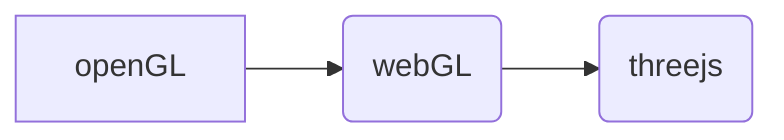
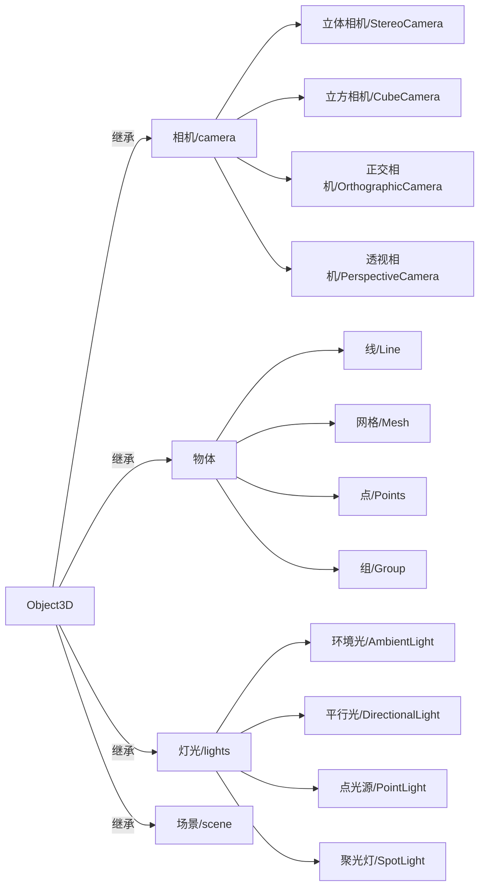
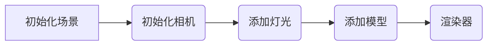

### 二、基础内容

#### 1、threejs技术的发展

​	threejs是JavaScript编写的WebGL第三方库，是一款运行在浏览器中的 3D 引擎。所以介绍threejs我们需要从下面两个知识点进行说明。

​	（1）什么是openGL。

​	（2）什么是webGL。

​	**opneGL**：是Khronos Group开发维护的一个规范，它主要为我们定义了用来操作图形和图片的一系列函数的API，需要注意的是OpenGL本身并非API。GPU的硬件开发商则需要提供满足OpenGL规范的实现，这些实现通常被称为“驱动”，它们负责将OpenGL定义的API命令翻译为GPU指令。

<!--more-->

​	**webGL（全写Web Graphics Library）**：是一种3D绘图协议，这种绘图技术标准允许把JavaScript和OpenGL ES 2.0结合在一起，通过增加OpenGL ES 2.0的一个JavaScript绑定，WebGL可以为HTML5 Canvas提供硬件3D加速渲染，这样Web开发人员就可以借助系统显卡来在浏览器里更流畅地展示3D场景和模型了，还能创建复杂的导航和数据视觉化。WebGL完美地解决了现有的Web交互式三维动画的两个问题：第一，它通过[HTML脚本](https://baike.baidu.com/item/HTML%E8%84%9A%E6%9C%AC)本身实现Web交互式三维动画的制作，无需任何浏览器插件支持;第二，它利用底层的图形[硬件加速](https://baike.baidu.com/item/%E7%A1%AC%E4%BB%B6%E5%8A%A0%E9%80%9F)功能进行的图形渲染，是通过统一的、标准的、跨平台的OpenGL接口实现的。（其他的web3D技术：Cult3D、Viewpoint、Atmosphere等等都需要插件）。



[常见js 3D引擎](<https://www.cnblogs.com/fuqiang88/p/5577642.html>)（Babylon.js、Three.js、Turbulenz等等）。

#### 2、threejs基础知识

（1）[基础对象](<https://threejs.org/>)

- [ ] 常量(Constants) 
- [x] 相机(Cameras) 
- [ ] 核心模块(Core)
- [x] 灯光(Lights) 
- [ ] 加载器(Loaders)
- [ ] 材质(Materials)
- [ ] 数学工具库(Math) 
- [x] 物体/模型 
- [ ] 渲染器(Renderers) 
- [x] 渲染器 / WebGL
- [x] 场景(Scenes) 
- [ ] 纹理(Textures) 
- [ ] 动画(Animation) 
- [ ] 几何模型(Geometries) 
- [ ] 辅助对象(Helpers) 

（2）常用对象的关系[场景（scene）、相机(camera)、物体、光照（lights）、渲染器（rendner）]



- **Object3D**是Three.js中大部分对象的基类，提供了一系列的属性和方法来对三维空间中的物体进行操纵

> Object3D的常用属性和方法：
>
> - .rotation 物体局部旋转，以弧度来表示。
> - scale : Vector3  物体局部缩放，默认值Vector3 (1,1,1)。
> - userData:object  用于存储自定义数据对象。
> - lookAt(Vector3 )  旋转物体使其面朝场景的某一点。
> - remove(object3D...)  从当前子对象中移除对象。
> - rotateX(float)、rotateY(float)、rotateZ(float)  绕局部空间的X、Y、Z轴旋转

- **场景（scene）**

> 场景允许你在什么地方、摆放什么东西来交给three.js来渲染，这是你放置物体、灯光和摄像机的地方。
>
> 初始化场景对象：
>
> ```javascript
> new THREE.Scene();
> ```

- **相机(camera)**

> ​	摄像机的抽象基类。在构建新摄像机时，应始终继承此类。我们这里主讲透视相机。
>
> ​	透视相机（PerspectiveCamera：这一投影模式被用来模拟人眼所看到的景象，它是3D场景的渲染中使用得最普遍的投影模式。
>
> 构造函数：
>
> ```javascript
> new THREE.PerspectiveCamera( fov : Number, aspect : Number, near : Number, far : Number )
> fov — 摄像机视锥体垂直视野角度
> aspect — 摄像机视锥体长宽比
> near — 摄像机视锥体近端面
> far — 摄像机视锥体远端面
> ```

- ***物体***

> 物体及我们所说的模型，有三种创建模型的方式：
>
> （1）根据threejs的几何体对象创建。
>
> （2）自己利用程序绘制几何体创建。
>
> （3）外部3D模型导入。
>
> 在创建模型过程中，我们会涉及到另外两个常用的对象，材质和纹理。
>
> **材质**：材质描述了对象objects的外观。它们的定义方式与渲染器无关， 因此，如果您决定使用不同的渲染器，不必重写材质。threejs定义了许多不同的材质对象：
>
> ​	基础网格材质、基础线条材质、Phong网格材质、着色器材质等等。

- **光照（lights）**

> 光源是场景中十分重要的一部分，没有光源，渲染的场景将不可见。threejs中定义了下列几种光源：
>
> （1）环境光（AmbientLight）
>
> ```javascript
> new THREE.AmbientLight( color : Integer, intensity : Float )
> color - (参数可选）颜色的rgb数值。缺省值为 0xffffff。
> intensity - (参数可选)光照的强度。缺省值为 1。
> ```
>
> （2）平行光（DirectionalLight）
>
> （3）点光源（PointLight）
>
> （4）聚光灯（SpotLight）
>
> （5）半球光（HemisphereLight）
>
> .castShadow属性表示是否投射阴影。其中 AmbientLight、HemisphereLight的castShadow是undefined。如果需要模型有阴影，除了设置光源的 castShadow为true,还需要设置渲染器需要阴影效果：
>
> ```javascript
> renderer.shadowMap.enabled = true;
> renderer.shadowMap.type = THREE.PCFSoftShadowMap; // 默认的是，没有设置的这个清晰 THREE.PCFShadowMap
> ```

- ***渲染器（rendner）***

> threejs有以下几种渲染器：
>
> （1）WebGLRenderer
>
> ```javascript
> this.renderer = new THREE.WebGLRenderer({
>    // 在 css 中设置背景色透明显示渐变色
>    alpha: true,
>    // 开启抗锯齿
>    antialias: true
> });
> // 定义渲染器的尺寸；在这里它会填满整个屏幕
> this.renderer.setSize(this.WIDTH, this.HEIGHT);
> this.container.appendChild(this.renderer.domElement);
> ```
>
> （2）[CSS2DRenderer](<https://threejs.org/examples/#css2d_label>)
>
> （3）[CSS3DRenderer](<https://threejs.org/examples/#css3d_periodictable>)
>
> （4）SVGRenderer

#### 3、3D场景的创建流程



#### 4、demo源码分析

```javascript
import './BackgroundImage.css';
import React, { Component } from 'react';
import * as THREE from 'three';
import * as dat from 'dat.gui';
import Orbitcontrols from 'three-orbitcontrols';
import * as Stats from 'stats.js'


class BackgroundImage extends Component {
    componentDidMount() {
        this.container = document.getElementById('container');
        this.width = this.container.clientWidth;
        this.height = this.container.clientHeight;
        this.initScene();
        this.initCamera();
        this.initLight();
        this.initModal();
        this.initRenderer();

        this.controls = new Orbitcontrols(this.camera, this.renderer.domElement);
        this.initGui();
        this.initStats();
        this.animate();
    }

    componentWillUnmount() {
        this.renderer.forceContextLoss();
        this.renderer.dispose();
        window.cancelAnimationFrame(this.animationID);
        this.scene.dispose();
        this.controls.dispose();
    }

    //初始化场景
    initScene = () => {

        this.scene = new THREE.Scene();
        // 在场景中添加雾的效果，参数分别代表‘雾的颜色’、‘开始雾化的视线距离’、刚好雾化至看不见的视线距离’
        this.scene.fog = new THREE.Fog(0x090918, 1, 600);
    }

    //初始化相机
    initCamera = () => {
        /**
     * PerspectiveCamera 透视相机
     * @param fieldOfView 视角
     * @param aspectRatio 纵横比
     * @param nearPlane 近平面
     * @param farPlane 远平面
     */
        this.camera = new THREE.PerspectiveCamera(60, this.width / this.height, 1, 10000);
        this.camera.position.set(0, 10, 100);
        this.camera.lookAt(new THREE.Vector3(0, 0, 0));
    }


    //光源
    initLight = () => {
        let ambientLight = new THREE.AmbientLight(0x0c0c0c);

        let spotLight1 = new THREE.SpotLight(0xffffff);
        spotLight1.position.set(-400, -400, -400);

        let spotLight2 = new THREE.SpotLight(0xffffff);
        spotLight2.position.set(0, 0, 400);

        this.scene.add(ambientLight);
        this.scene.add(spotLight2);
    }

    //模型
    initModal = () => {
        //材质
        let material = new THREE.MeshPhongMaterial();
        material.map = new THREE.TextureLoader().load(require('./Earth.png'));
        //几何体
        let sphereGeometry = new THREE.SphereGeometry(40, 50, 50);

        //模型  
        this.sphere = new THREE.Mesh(sphereGeometry, material);
        this.scene.add(this.sphere);
    }

    //渲染器
    initRenderer = () => {
        // 开启抗锯齿
        // 在 css 中设置背景色透明显示渐变色
        this.renderer = new THREE.WebGLRenderer({ antialias: true, alpha: true });
        // 定义渲染器的尺寸；在这里它会填满整个屏幕
        this.renderer.setSize(this.width, this.height);
        this.container.appendChild(this.renderer.domElement);
    }

    //动画刷新
    animate = () => {
        this.animateID = requestAnimationFrame(this.animate);
        this.controls.update();
        this.stats.update();
        //this.stats.update();
        if (this.sphere) {
            this.sphere.rotateY(0.001);
        }
        this.renderer.render(this.scene, this.camera);
    }


    initGui = () => {
        let objThis = this;
        let guiControls = new function () {
            this.clearAlpha = objThis.renderer.getClearAlpha();
            this.clearColor = objThis.renderer.getClearColor().getStyle();
        };

        let gui = new dat.GUI();
        gui.add(guiControls, 'clearAlpha', 0, 1).onChange(function (e) {
            objThis.renderer.setClearAlpha(e);
        });
        gui.addColor(guiControls, 'clearColor').onChange(function (e) {
            objThis.renderer.setClearColor(new THREE.Color(e), objThis.renderer.getClearAlpha());
        });
    }

    //性能插件
    initStats = () => {
        this.stats = new Stats();
        this.container.appendChild(this.stats.dom);
    }


    render() {
        return (
            <div id='container'></div>
        )
    }

}

export default BackgroundImage
```

```javascript
#container{
    position:absolute;
    width:100%;
    top:0;
    bottom:0;
    overflow: hidden;
    background: url("./bgc-map.jpg") center no-repeat;
    -webkit-background-size: cover;
    background-size: cover;
}
```

